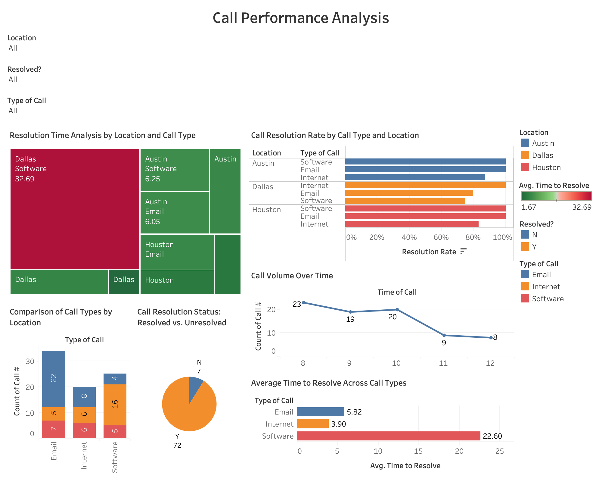

# 📊 Call Performance Analysis Dashboard

An interactive Tableau dashboard analysing call centre performance across three locations — **Austin, Dallas, and Houston** — tracking resolution times, call volumes, and resolution rates by call type.

---

## 📁 Dataset Overview

The dataset contains **79 call records** from a multi-location call centre, with the following fields:

| Field | Description |
|-------|-------------|
| `Call #` | Unique call identifier |
| `Time of Call` | Time the call was received (decimal format) |
| `Type of Call` | Email, Internet, or Software |
| `Time to Resolve` | Resolution time in minutes |
| `Resolved?` | Whether the call was resolved (Y/N) |
| `Location` | Austin, Dallas, or Houston |

**Call Types:**
- **Email** — Email-related support queries
- **Internet** — Internet connectivity and access issues
- **Software** — Software troubleshooting and technical support

---

## 📈 Dashboard Views

### 1. Resolution Time Analysis by Location and Call Type
A treemap showing average resolution time across all location and call type combinations. Highlights that **Dallas Software calls** have the highest average resolution time at **32.69 minutes**, significantly above all other combinations.

### 2. Call Resolution Rate by Call Type and Location
A horizontal bar chart showing the percentage of resolved vs. unresolved calls across all location and call type combinations. Austin consistently shows strong resolution rates across all three call types.

### 3. Comparison of Call Types by Location
A stacked bar chart showing call volume distribution across Email, Internet, and Software calls by location. **Email calls** have the highest overall volume (34 total), with Austin handling the majority.

### 4. Call Resolution Status: Resolved vs. Unresolved
A pie chart showing the overall resolution rate across all calls. **72 out of 79 calls (91%)** were successfully resolved, with only 7 remaining unresolved.

### 5. Call Volume Over Time
A line chart tracking call volume by time of day, showing a peak of **23 calls** at 8:00 AM and a gradual decline through to 12:00 PM with **8 calls**.

### 6. Average Time to Resolve Across Call Types
A horizontal bar chart comparing average resolution time by call type. **Software calls take significantly longer** to resolve (avg. 22.60 minutes) compared to Email (5.82 min) and Internet (3.90 min).

---

## 🔍 Key Insights

- **Software calls are the most time-intensive** — averaging 22.60 minutes to resolve, nearly 4x longer than Email and 6x longer than Internet calls
- **Dallas Software calls are the biggest bottleneck** — the single highest average resolution time at 32.69 minutes
- **91% overall resolution rate** — strong performance, but the 9% unresolved calls are concentrated in Software and Internet types
- **Call volume peaks at 8:00 AM** — staffing and resource allocation should prioritise early morning hours
- **Austin outperforms** other locations on resolution rates across all call types

---

## 🛠 Tools Used

- **Tableau Desktop** — dashboard design and visualisation
- **Microsoft Excel** — data source

---

## 📌 Dashboard Screenshot

---

## 👩‍💻 Author

**Haniyah Saleem**
MS Business Analytics, Qatar University
[haniyahsaleem05@gmail.com](mailto:haniyahsaleem05@gmail.com)
